# Configuration model

!!! info "Generated page"
    The composition root is `TriBridConfig`; every section is a Pydantic model whose fields are the
    public wire contract (regenerated into `web/src/types/generated.ts`). Field-level pages live under the
    configuration reference.

```mermaid
flowchart LR
    root["TriBridConfig\nserver/models/tribrid_config_model.py"]
    n_retrieval["retrieval\n30 fields"]
    root --> n_retrieval
    n_semantic_cache["semantic_cache\n13 fields"]
    root --> n_semantic_cache
    n_scoring["scoring\n5 fields"]
    root --> n_scoring
    n_layer_bonus["layer_bonus\n6 fields"]
    root --> n_layer_bonus
    n_embedding["embedding\n18 fields"]
    root --> n_embedding
    n_tokenization["tokenization\n7 fields"]
    root --> n_tokenization
    n_chunking["chunking\n18 fields"]
    root --> n_chunking
    n_indexing["indexing\n19 fields"]
    root --> n_indexing
    n_graph_storage["graph_storage\n12 fields"]
    root --> n_graph_storage
    n_graph_indexing["graph_indexing\n28 fields"]
    root --> n_graph_indexing
    n_qdrant["qdrant\n1 fields"]
    root --> n_qdrant
    n_fusion["fusion\n6 fields"]
    root --> n_fusion
    n_vector_search["vector_search\n3 fields"]
    root --> n_vector_search
    n_sparse_search["sparse_search\n4 fields"]
    root --> n_sparse_search
    n_graph_search["graph_search\n9 fields"]
    root --> n_graph_search
    n_reranking["reranking\n12 fields"]
    root --> n_reranking
    n_generation["generation\n10 fields"]
    root --> n_generation
    n_enrichment["enrichment\n6 fields"]
    root --> n_enrichment
    n_chunk_summaries["chunk_summaries\n8 fields"]
    root --> n_chunk_summaries
    n_keywords["keywords\n5 fields"]
    root --> n_keywords
    n_tracing["tracing\n29 fields"]
    root --> n_tracing
    n_training["training\n46 fields"]
    root --> n_training
    n_ui["ui\n45 fields"]
    root --> n_ui
    n_chat["chat\n21 fields"]
    root --> n_chat
    n_hydration["hydration\n2 fields"]
    root --> n_hydration
    n_evaluation["evaluation\n14 fields"]
    root --> n_evaluation
    n_system_prompts["system_prompts\n11 fields"]
    root --> n_system_prompts
    n_mcp["mcp\n10 fields"]
    root --> n_mcp
    n_synthetic["synthetic\n3 fields"]
    root --> n_synthetic
    n_docker["docker\n7 fields"]
    root --> n_docker
    n_document_viewer["document_viewer\n3 fields"]
    root --> n_document_viewer
```

| Section | Fields | Purpose | Reference |
|---|---|---|---|
| `retrieval` | 30 | Configuration for retrieval and search parameters. | [retrieval](../config/retrieval.md) |
| `semantic_cache` | 13 | Configuration for semantic caching across search/answer/chat endpoints. | [semantic_cache](../config/semantic_cache.md) |
| `scoring` | 5 | Configuration for result scoring and boosting. | [scoring](../config/scoring.md) |
| `layer_bonus` | 6 | Layer-specific scoring bonuses with intent-aware matrix. | [layer_bonus](../config/layer_bonus.md) |
| `embedding` | 18 | Embedding generation and caching configuration. | [embedding](../config/embedding.md) |
| `tokenization` | 7 | Tokenizer configuration used for token-aware chunking and budgeting. | [tokenization](../config/tokenization.md) |
| `chunking` | 18 | Chunking configuration for documents and code. | [chunking](../config/chunking.md) |
| `indexing` | 19 | Indexing and vector storage configuration. | [indexing](../config/indexing.md) |
| `graph_storage` | 12 | Configuration for Neo4j graph storage and traversal. | [graph_storage](../config/graph_storage.md) |
| `graph_indexing` | 28 | Configuration for building/persisting graph data during indexing. | [graph_indexing](../config/graph_indexing.md) |
| `qdrant` | 1 | Qdrant vector-store connection for the canonical dense + sparse retrieval lane. | [qdrant](../config/qdrant.md) |
| `fusion` | 6 | Configuration for tri-brid fusion of vector + sparse + graph results. | [fusion](../config/fusion.md) |
| `vector_search` | 3 | Configuration for the vector (dense) leg served by Qdrant. | [vector_search](../config/vector_search.md) |
| `sparse_search` | 4 | Configuration for the sparse (IDF-modified BM25 sparse vectors in Qdrant) leg. | [sparse_search](../config/sparse_search.md) |
| `graph_search` | 9 | Configuration for graph-based search using Neo4j. | [graph_search](../config/graph_search.md) |
| `reranking` | 12 | Reranking configuration for result refinement. | [reranking](../config/reranking.md) |
| `generation` | 10 | LLM generation configuration. | [generation](../config/generation.md) |
| `enrichment` | 6 | Code enrichment and chunk_summary generation configuration. | [enrichment](../config/enrichment.md) |
| `chunk_summaries` | 8 | Chunk summary builder filtering configuration. | [chunk_summaries](../config/chunk_summaries.md) |
| `keywords` | 5 | Discriminative keywords configuration. | [keywords](../config/keywords.md) |
| `tracing` | 29 | Observability and tracing configuration. | [tracing](../config/tracing.md) |
| `training` | 46 | Reranker training configuration. | [training](../config/training.md) |
| `ui` | 45 | User interface configuration. | [ui](../config/ui.md) |
| `chat` | 21 | Top-level chat configuration. Lives at TriBridConfig.chat. | [chat](../config/chat.md) |
| `hydration` | 2 | Context hydration configuration. | [hydration](../config/hydration.md) |
| `evaluation` | 14 | Evaluation dataset configuration. | [evaluation](../config/evaluation.md) |
| `system_prompts` | 11 | System prompts for LLM interactions - affects RAG pipeline behavior. | [system_prompts](../config/system_prompts.md) |
| `mcp` | 10 | Inbound MCP (Model Context Protocol) server configuration. | [mcp](../config/mcp.md) |
| `synthetic` | 3 | Top-level synthetic data pipeline configuration. | [synthetic](../config/synthetic.md) |
| `docker` | 7 | Docker infrastructure configuration. | [docker](../config/docker.md) |
| `document_viewer` | 3 | Source document evidence viewer: how cited files are rendered back to the user. | [document_viewer](../config/document_viewer.md) |
