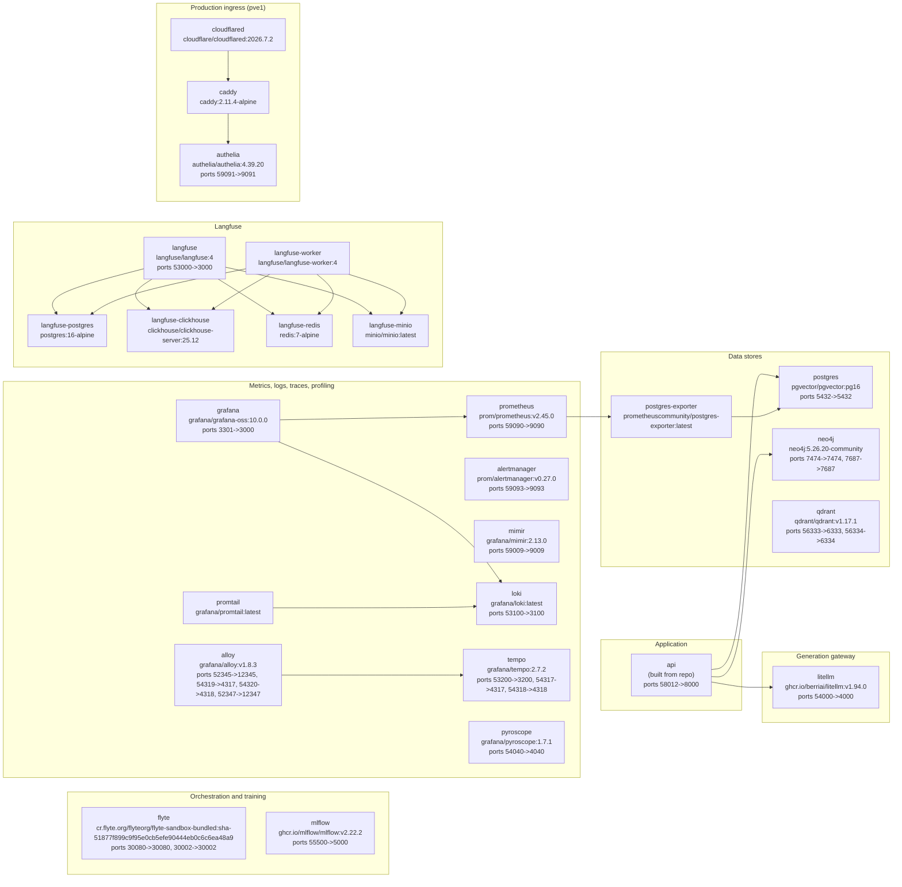

# Runtime topology

!!! info "Generated page"
    Drawn from `docker-compose.yml`, `infra/docker-compose.observability.yml` and
    `deploy/proxmox/docker-compose.yml` on every docs-autopilot run. Edit the compose files, not this page.

26 services; an arrow means *depends on*. Host ports are the defaults from the compose files
(`HOST->CONTAINER`), all bound to `127.0.0.1`; the pve1 overlay exposes the app only through Cloudflare Tunnel -> Caddy -> Authelia.

## Every service

| Service | Image | Host ports | Depends on | Defined in |
|---|---|---|---|---|
| `alertmanager` | `prom/alertmanager:v0.27.0` | 59093->9093 | - | observability overlay |
| `alloy` | `grafana/alloy:v1.8.3` | 52345->12345, 54319->4317, 54320->4318, 52347->12347 | `tempo` | observability overlay, pve1 production overlay |
| `api` | `(built from repo)` | 58012->8000 | `postgres`, `neo4j`, `litellm` | base |
| `authelia` | `authelia/authelia:4.39.20` | 59091->9091 | - | pve1 production overlay |
| `caddy` | `caddy:2.11.4-alpine` | - | `authelia` | pve1 production overlay |
| `cloudflared` | `cloudflare/cloudflared:2026.7.2` | - | `caddy` | pve1 production overlay |
| `flyte` | `cr.flyte.org/flyteorg/flyte-sandbox-bundled:sha-51877f899c9f95e0cb5efe90444eb0c6c6ea48a9` | 30080->30080, 30002->30002 | - | base |
| `grafana` | `grafana/grafana-oss:10.0.0` | 3301->3000 | `prometheus`, `loki` | base, pve1 production overlay |
| `langfuse` | `langfuse/langfuse:4` | 53000->3000 | `langfuse-postgres`, `langfuse-clickhouse`, `langfuse-redis`, `langfuse-minio` | observability overlay, pve1 production overlay |
| `langfuse-clickhouse` | `clickhouse/clickhouse-server:25.12` | - | - | observability overlay, pve1 production overlay |
| `langfuse-minio` | `minio/minio:latest` | - | - | observability overlay, pve1 production overlay |
| `langfuse-postgres` | `postgres:16-alpine` | - | - | observability overlay, pve1 production overlay |
| `langfuse-redis` | `redis:7-alpine` | - | - | observability overlay, pve1 production overlay |
| `langfuse-worker` | `langfuse/langfuse-worker:4` | - | `langfuse-postgres`, `langfuse-clickhouse`, `langfuse-redis`, `langfuse-minio` | observability overlay, pve1 production overlay |
| `litellm` | `ghcr.io/berriai/litellm:v1.94.0` | 54000->4000 | - | base |
| `loki` | `grafana/loki:latest` | 53100->3100 | - | base |
| `mimir` | `grafana/mimir:2.13.0` | 59009->9009 | - | observability overlay |
| `mlflow` | `ghcr.io/mlflow/mlflow:v2.22.2` | 55500->5000 | - | base |
| `neo4j` | `neo4j:5.26.20-community` | 7474->7474, 7687->7687 | - | base |
| `postgres` | `pgvector/pgvector:pg16` | 5432->5432 | - | base |
| `postgres-exporter` | `prometheuscommunity/postgres-exporter:latest` | - | `postgres` | base |
| `prometheus` | `prom/prometheus:v2.45.0` | 59090->9090 | `postgres-exporter` | base |
| `promtail` | `grafana/promtail:latest` | - | `loki` | base |
| `pyroscope` | `grafana/pyroscope:1.7.1` | 54040->4040 | - | observability overlay |
| `qdrant` | `qdrant/qdrant:v1.17.1` | 56333->6333, 56334->6334 | - | base |
| `tempo` | `grafana/tempo:2.7.2` | 53200->3200, 54317->4317, 54318->4318 | - | observability overlay |
