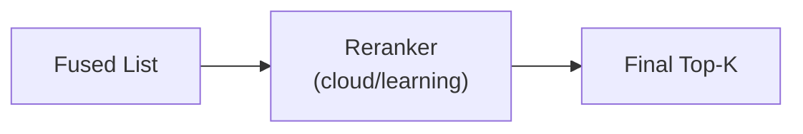

# Reranking (Cloud, Learning)

<div class="grid chunk_summaries" markdown>

-   :material-sort-variant:{ .lg .middle } **Reorder Candidates**

    ---

    Cloud rerankers and the Qwen3 LoRA learning reranker refine fused candidates for precision.

-   :material-chip:{ .lg .middle } **Cloud Reranker**

    ---

    Use Cohere/Voyage/Jina via API.

-   :material-school:{ .lg .middle } **Learning Reranker**

    ---

    Mine triplets and fine-tune a task-specific reranker.

</div>

[Get started](index.md){ .md-button .md-button--primary }
[Configuration](configuration.md){ .md-button }
[API](api.md){ .md-button }

!!! tip "Balanced TopN"
    Use `tribrid_reranker_topn=40..60` for quality vs latency.

!!! note "Cloud Limits"
    Respect provider token limits and per-request pricing; tune `reranker_cloud_top_n` accordingly.

## Modes and Fields

| Field | Meaning |
|-------|---------|
| `reranking.reranker_mode` | `none` \| `learning` \| `cloud` (legacy `local`/`hf` normalize to `learning`) |
| `reranking.reranker_cloud_provider` | `cohere` \| `voyage` \| `jina` |
| `reranking.reranker_cloud_model` | Provider-scoped model id |
| `reranking.tribrid_reranker_topn` | Candidates to rerank |
| `reranking.reranker_timeout` | Timeout for API calls (default 30 s — see the note below) |

!!! note "The default timeout is now 30 s (was 10 s)"
    The default cloud window (50 candidates × 700 chars) takes 6–10 s through the gateway at idle, so the retired 10 s default sat inside the idle spread of the very call it had to score and failed chats with a gateway ReadTimeout. A persisted config still carrying `10` — the retired default, which the config page stored verbatim — is migrated to 30 on load (`server/services/config_store.py`); an operator-set value like `12` is kept. Tune the value from your alias's real p95, not from a guess.

!!! note "Configured vs Active on `/api/reranker/info`"
    Reranker config is **corpus-scoped**, and `GET /api/reranker/info?corpus_id=...` now resolves the same scoped config the mode selector writes — calling it without a corpus reports the global config. The response carries an authoritative `active` flag plus an `active_reason` sentence computed server-side: `active=true` means reranking will actually run for that corpus (cloud mode with provider and model set, or a learning adapter promoted), and `active=false` says why not (mode `none`, cloud selected but nothing configured, or learning selected with no adapter promoted under `models/learning-reranker-active`). The **RAG → Reranker** card shows both lines — `Configured: … · Active: yes/no` with the reason underneath — so the page can no longer say CLOUD in the mode selector while the runtime is silently disabled.

!!! note "A configured reranker fails closed (typed `reranker_failed`)"
    When `reranking.reranker_mode` is `learning` or `cloud`, a reranker that cannot run is no longer a silent skip to the fusion order. A missing trained adapter, a missing `COHERE_API_KEY`, an unreachable or unauthenticated gateway route, or a reasoning alias that exhausts its output budget raises the typed `RerankerFailedError` (`server/retrieval/errors.py`), and every retrieval surface — `/api/search`, `/api/answer` (both routes), chat non-stream and stream, the benchmark, and the MCP `search`/`answer` tools — answers `503 reranker_failed` with a sanitised reason and an operator hint (fix the named lane, or set the mode to `none`). Ragweld never substitutes the unreranked fusion order: it is a different answer, not a degraded one.

!!! note "Cloud mode starts with no model selected"
    `reranking.reranker_cloud_model` now defaults to empty instead of a hardcoded alias, and GPT-4-class aliases are refused wherever a paid model identity is configured (`server/model_policy.py`). Select an allowed catalog alias in **RAG → Reranker** before switching the mode to `cloud` — until you do, the reranker is configured but not active, which `GET /api/reranker/info` reports through its `active` flag. See [Model catalog](models.md).

!!! note "The gateway reranker asks reasoning-capable aliases to stop thinking"
    In `cloud` mode with `reranking.reranker_cloud_provider=litellm`, the listwise request now shapes itself to the alias's upstream (`server/gateway_reasoning.py`): an OpenRouter upstream receives OpenRouter's native `reasoning` object carrying the **lowest reasoning effort that provider honours** (`none` everywhere except Google and Z.ai, whose endpoints declare reasoning mandatory and get `minimal`), and the output budget is sized from the verdict the prompt asks for — 40 tokens per candidate plus headroom, roughly double the most verbose measured 50-candidate verdict. Previously a reasoning-capable alias spent its whole output budget thinking about the candidates and returned an empty or truncated score array (one measured drive: `openai.gpt-5.6-luna` failed 1 in 3 at 50 candidates, `google.gemini-3.7-flash` and `deepseek.deepseek-v4-flash` failed every time). When an alias still exhausts its budget the failure is typed (`GatewayRerankBudgetError`): the message names the alias, the reasoning tokens spent (or that the score array alone outgrew the budget), and the fix — point `reranking.reranker_cloud_model` at a non-reasoning alias, or lower `reranking.reranker_cloud_top_n`. The local lane (`openai/ragweld-local`) keeps its thinking control at the serving layer and needs no per-request field. The reranker calls with the `system_prompts.gateway_rerank` prompt; see the [system prompts reference](reference/config/system_prompts.md).

### Example: Enable Weighted Fusion + Learning Rerank

=== "Python"
```python
import httpx
base = "http://localhost:8000"
httpx.patch(f"{base}/config/fusion", json={"method":"weighted","vector_weight":0.4,"sparse_weight":0.3,"graph_weight":0.3}).raise_for_status()
httpx.patch(f"{base}/config/reranking", json={"reranker_mode":"learning","tribrid_reranker_topn":50}).raise_for_status()
```

=== "curl"
```bash
BASE=http://localhost:8000
curl -sS -X PATCH "$BASE/config/fusion" -H 'Content-Type: application/json' -d '{"method":"weighted","vector_weight":0.4,"sparse_weight":0.3,"graph_weight":0.3}' | jq .
curl -sS -X PATCH "$BASE/config/reranking" -H 'Content-Type: application/json' -d '{"reranker_mode":"learning","tribrid_reranker_topn":50}' | jq .
```

=== "TypeScript"
```typescript
await fetch('/config/fusion', { method:'PATCH', headers:{'Content-Type':'application/json'}, body: JSON.stringify({ method:'weighted', vector_weight:0.4, sparse_weight:0.3, graph_weight:0.3 }) });
await fetch('/config/reranking', { method:'PATCH', headers:{'Content-Type':'application/json'}, body: JSON.stringify({ reranker_mode:'learning', tribrid_reranker_topn:50 }) });
```



??? info "Learning Reranker"
    Use `/reranker/mine`, `/reranker/train/start`, `/reranker/train/run/stream` to build a corpus-specific reranker. See API docs for streaming metrics and diffing runs.
