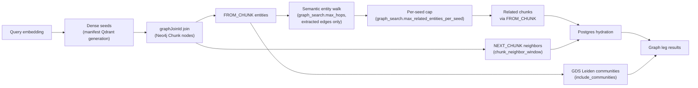

# Graph Retrieval and Storage

<div class="grid chunk_summaries" markdown>

-   :material-graph:{ .lg .middle } **Graph Storage**

    ---

    Neo4j stores entities/relationships; per-corpus isolation via database selection.

-   :material-route:{ .lg .middle } **Traversal**

    ---

    Expand from seeds with `max_hops`, optionally adding neighbor context.

-   :material-cog-sync:{ .lg .middle } **Indexing Hooks**

    ---

    Build the lexical graph, run semantic or AST extraction, resolve entities, and derive GDS Leiden communities at index time.

</div>

[Get started](../index.md){ .md-button .md-button--primary }
[Configuration](../configuration.md){ .md-button }
[API](../api.md){ .md-button }

!!! tip "Chunk Mode"
    There is no chunk/entity mode switch. Every enabled corpus uses the same Qdrant-seeded Neo4j traversal; the per-corpus choice is the derived graph policy (`semantic`, `code`, `off`, or `excluded`) shown as a badge in RAG → Indexing.

!!! note "Per-Corpus Database"
    Use `graph_storage.neo4j_database_mode="per_corpus"` (Neo4j Enterprise) for hard isolation.

!!! note "Generation-scoped by construction"
    Both stores are read through the manifest: dense seeds come from the physical Qdrant collection it names, and traversal runs only against the Neo4j graph id in the same manifest. Chunks join to entities through a generation-qualified `graph_join_id` payload, so a superseded generation can never leak entities into a live search.

## Search Configuration (Selected)

| Field | Default | Description |
|-------|---------|-------------|
| `graph_search.enabled` | true | Enable graph leg |
| `graph_search.max_hops` | 2 | Traversal depth |
| `graph_search.top_k` | 30 | Qdrant seed Top-K |
| `graph_search.chunk_neighbor_window` | 1 | Include adjacent `NEXT_CHUNK` chunks around relationship hits |
| `graph_search.include_communities` | true | Include community expansion (GDS Leiden) |
| `graph_search.max_related_entities_per_seed` | 50 | Cap on related entities each seed entity may contribute (nearest first, then most connected) — bounds how far a hub entity expands |

!!! note "Co-mention is not adjacency, and hubs are capped"
    Entity expansion walks the **semantic graph only** (`server/retrieval/graphrag_retriever.py`): every node on an entity path must be an `__Entity__`, and no relationship on the path may be lexical structure (`FROM_CHUNK`, `NEXT_CHUNK`, `FROM_DOCUMENT` — the structural set is derived from the same `LexicalGraphConfig` the index writer uses), so two entities co-mentioned in one chunk are not neighbours unless the extractor linked them with a real relationship. Each seed entity keeps at most `graph_search.max_related_entities_per_seed` related entities, **nearest first, then by how many paths connect them**, so a hub entity — a person named in most of a corpus, say — cannot reach nearly every entity within two hops and turn one query into a corpus-wide scan. Raise the cap for sparse, well-linked graphs where recall matters more than latency; lower it when a few hubs dominate the graph and p95 search latency climbs. The Cypher ceiling (`1000`) and the Pydantic field's upper bound are the same contract.

## Storage Configuration (Selected)

| Field | Default | Description |
|-------|---------|-------------|
| `graph_storage.neo4j_uri` | `bolt://localhost:7687` | Connection URI |
| `graph_storage.neo4j_user` | `neo4j` | Username |
| `graph_storage.neo4j_password` | — | Password |
| `graph_storage.max_hops` | 2 | Default traversal bound |
| `graph_indexing.build_code_graph` | false | Select the AST code-graph policy for a code corpus |

### Code graph artifacts

The AST code graph written by `graph_indexing.build_code_graph` lands in the same Neo4j lane as the lexical graph. `contains`, `inherits`, `imports`, and `calls` edges link module/class/function entities, each anchored to its defining chunk through `FROM_CHUNK`, so a seed chunk hit can reach its callers, base classes, and importing modules. See the [Indexing pipeline](../indexing.md) for build details and the [`graph_indexing` config reference](../reference/config/graph_indexing.md) for edge weights and timeouts.

Cross-file edges are held back during the per-file pass and written in one relationship-only upsert after the run's last file (`server/api/index.py`), so both endpoints always exist in Neo4j under their real labels when the edge lands — a call to an imported class resolves to the `class` node, never to a guessed label. Entity ids are corpus-relative (`file_path` for modules, `file_path::qualname` for symbols), with uniqueness scoped by corpus.

The entity inspection endpoints take the id as a query parameter (`/graph/{corpus_id}/entity?entity_id=...`), so ids containing `/` and `::` (for example `server/services/traces.py::TraceStore.add_event`) need no path encoding. See [Graph API](../api_graph.md).

!!! note "Types come from the graph, not from an enum"
    The wire models carry `entity_type` and `relation_type` as open strings (`server/models/tribrid_config_model.py`): AST kinds for code graphs, and the approved schema's node labels and relationship types verbatim for semantic graphs. `server/db/neo4j.py` returns what the store holds — no coercion to a generic kind, no filtering against a fixed type allowlist — so schema edges survive into every explorer response. Neighbourhood and community walks are confined to `__Entity__` nodes of the generation, so a traversal can never cross a `Chunk` node and report co-mentioned entities as neighbours. Names are read honestly as well: the proposal normalizer (`server/indexing/graphrag_schema.py`) gives every node type a `name` identity property with a mandatory constraint, so a promoted generation writes a name on every entity; a generation approved before that rule can hold anonymous entities, which read back an **empty** `name` — never the text `"None"` that `str(None)` used to produce — and the Graph explorer falls back to the stable entity id for the label.

!!! note "The File line is provenance, not a node property"
    Code entities store the file that defines them on the node itself. Semantic entities carry no `file_path` of their own — the GraphRAG extractor links them to their source chunk with `FROM_CHUNK` and never copies the file onto the node — so every entity read view (`server/db/neo4j.py`, `entity_source_file_expr`) resolves the file through the provenance chunk of the current generation. An entity without provenance reads back `file_path: null` rather than a fabricated path, and a semantic entity reads back the file its chunk came from. See [Graph API](../api_graph.md).

After a successful index, ragweld also runs deterministic GDS Leiden community detection over the staged entities (`server/graph/communities.py`, GDS 2.13) and writes `communityId`/`communityPath` onto every entity, powering the community views here and community expansion in retrieval.

!!! tip "If you're not sure"
    Leave `build_code_graph` off for prose-heavy corpora and turn it on for code corpora where structural questions ("who calls this?", "what inherits from this?") matter. It is built during indexing, so plan a re-index after enabling.

*Concept diagram (the graph leg only — the full fused pipeline is on the [generated retrieval-pipeline page](../reference/architecture/retrieval-pipeline.md)):*



=== "Python"
```python
import httpx
base = "http://127.0.0.1:58012/api"
entities = httpx.get(f"{base}/graph/tribrid/entities").json()
first = entities[0]
rels = httpx.get(f"{base}/graph/tribrid/entity/neighbors", params={"entity_id": first["entity_id"]}).json()
print(first["name"], len(rels.get("relationships", [])))
```

=== "curl"
```bash
BASE=http://127.0.0.1:58012/api
curl -sS "$BASE/graph/tribrid/entities" | jq '.[0]'
```

=== "TypeScript"
```typescript
async function neighbors(corpus: string) {
  const ents = await (await fetch(`/api/graph/${corpus}/entities`)).json();
  const id = ents[0].entity_id;
  const rels = await (await fetch(`/api/graph/${corpus}/entity/neighbors?entity_id=${encodeURIComponent(id)}`)).json();
  console.log(id, rels.relationships.length);
}
```
