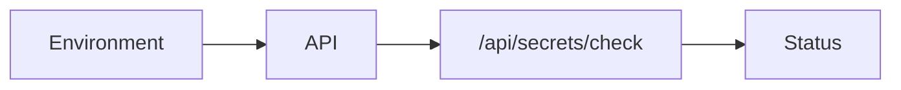

# Security and Secrets

<div class="grid chunk_summaries" markdown>

-   :material-shield-lock:{ .lg .middle } **Secrets**

    ---

    API keys for providers and DB credentials loaded from environment.

-   :material-account-key:{ .lg .middle } **Validation**

    ---

    `/api/secrets/check` verifies which provider keys are configured (never returns values).

-   :material-file-lock:{ .lg .middle } **Least Privilege**

    ---

    Restrict DB users and network access.

</div>

[Get started](index.md){ .md-button .md-button--primary }
[Configuration](configuration.md){ .md-button }
[API](api.md){ .md-button }

!!! tip "Separate Environments"
    Use different credentials per environment (dev, staging, prod). Never reuse production secrets locally.

!!! note ".env Hygiene"
    `.env` is for local dev only. In production, use a secret manager and inject env vars securely.

!!! warning "Transport Security"
    Terminate TLS in front of the API service. Restrict DB ports to private networks.

## Secrets Check

`/api/secrets/check` reports **app secret presence only** — never values, never authentication success, never upstream-provider readiness. The registered checks are the app's own credentials; the only provider key they cover today is the gateway client key.

!!! warning "Upstream provider keys are not app secret checks"
    `OPENAI_API_KEY`, `OPENROUTER_API_KEY`, `ANTHROPIC_API_KEY` and `GOOGLE_API_KEY` belong **only** in the LiteLLM gateway's private `infra/litellm.env` (initialized from `infra/litellm.env.example` on a new install; `disabled` is not a working key). They are never loaded into the app process — `./start.sh` unsets them, the Compose API service blanks them, and importing `server/main.py` drops any inherited values — so asking `/api/secrets/check` about one of them answers `400` instead of pretending to verify the gateway's upstream credential.

=== "Python"
```python
import httpx
print(httpx.get("http://127.0.0.1:58012/api/secrets/check", params={"keys": "LITELLM_API_KEY"}).json())
```

=== "curl"
```bash
curl -sS "http://127.0.0.1:58012/api/secrets/check?keys=LITELLM_API_KEY" | jq .
```

=== "TypeScript"
```typescript
async function secrets() {
  console.log(await (await fetch('/api/secrets/check?keys=LITELLM_API_KEY')).json());
}
```

## Credentials withheld from the browser

Two config fields are credential-shaped, and the API never puts their secret halves on the wire (`server/config_redaction.py`):

| Field | What is withheld | What stays editable |
|-------|------------------|---------------------|
| `indexing.postgres_url` | The password inside the DSN | Host, port, database, user |
| `tracing.otlp_headers` | The value of any authorization-type header (`Authorization`, `Proxy-Authorization`, `Api-Key`, or a name containing `token`/`secret`/`password`/`apikey`) | Every other header, e.g. `X-Scope-OrgID` |

The same two values ride in the config snapshot that every eval, reranker, agent-training and synthetic run record pins, and those records are redacted on the way **out** of their detail routes too — including records written before redaction existed.

The round-trip contract:

- `GET /api/config` (and the credential-shaped defaults in `/api/config/registry`) serve the marker `[redacted]` in place of each credential.
- A write (PUT or section PATCH) that returns the marker restores the stored value — "unchanged".
- Typing a real value rotates it. A marker with nothing stored behind it is refused with a typed `422` rather than persisted as a literal.

!!! tip "If a config field shows `[redacted]`"
    That is the withheld-credential marker, not a corrupted value. The **Infrastructure → Paths & Stores** and **RAG → Retrieval → Ops & Tracing** forms say so in place; leave the marker to keep the current secret.

The MCP bearer key is different on purpose: `MCP_API_KEY` is an environment secret and is never read from config, because config is served to the browser. See [MCP](mcp.md).

!!! note "Where this lives"
    - Redaction helpers: `server/config_redaction.py`
    - Config routes: `server/api/config.py`; run records: `server/api/eval.py`, `server/api/reranker.py`, `server/api/agent.py`, `server/synthetic/orchestrator.py`
    - Round-trip coverage: `tests/api/test_config_redaction.py`

## Environment Keys (Selected)

Gateway-owned upstream keys and app credentials are different boundaries; never mix them.

| Key | Owner | Purpose |
|-----|-------|---------|
| `OPENAI_API_KEY` | Gateway only (`infra/litellm.env`) | Upstream key for the native OpenAI embedding routes (`openai.text-embedding-3-small` / `openai.text-embedding-3-large`) |
| `OPENROUTER_API_KEY` | Gateway only (`infra/litellm.env`) | Upstream key for OpenRouter-routed generation aliases |
| `ANTHROPIC_API_KEY`, `GOOGLE_API_KEY` | Gateway only (`infra/litellm.env`) | Reserved gateway-owned upstream keys — never exported into the app process |
| `LITELLM_BASE_URL`, `LITELLM_API_KEY` | App | How the API authenticates to the local LiteLLM gateway; Compose maps `LITELLM_API_KEY` onto the gateway's `LITELLM_MASTER_KEY` |
| `VOYAGE_API_KEY`, `COHERE_API_KEY`, `JINA_API_KEY` | App | Provider access for embedding/rerank lanes that do not route through the gateway |
| `POSTGRES_*` | App | DB connection for chunk rows and generation manifests |
| `MCP_API_KEY` | App | Bearer token enforced by the embedded MCP transport when `mcp.require_api_key=true` — environment only, never a config field |
| `NEO4J_*` | App | Neo4j connection |
| `SERVER_PORT` | App | API service port |
| `CONFIG_FILE` | App | Path to `tribrid_config.json` |



!!! success "Audit"
    Log access to admin endpoints (`/api/config`, `/api/docker/*`, `/api/reranker/*`). Monitor for unusual patterns in logs and metrics.
