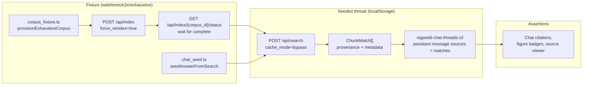

# Testing and Verification

<div class="grid chunk_summaries" markdown>

-   :material-test-tube:{ .lg .middle } **Zero-Mocked**

    ---

    Real integrations: no request interception or Python mocks.

-   :material-clipboard-text:{ .lg .middle } **Coverage by Change Type**

    ---

    Components → Playwright, APIs → pytest, Retrieval → relevance.

-   :material-shield-check:{ .lg .middle } **Gate to Done**

    ---

    You cannot return a response unless tests run and pass.

</div>

[Get started](index.md){ .md-button .md-button--primary }
[Configuration](configuration.md){ .md-button }
[API](api.md){ .md-button }

!!! tip "Real Results"
    Validate that search returns relevant chunks, not just 200 OK.

!!! note "CI Hooks"
    Stop hook blocks completion until validators and tests succeed.

!!! danger "No Mocks"
    - No Playwright `page.route(...).fulfill(...)`
    - No Python `unittest.mock` / `monkeypatch`

## Required Tests by Change Type

| Change | Required Test |
|--------|---------------|
| New component | Playwright: render, interact, verify state |
| Component edit | Playwright: existing tests still pass + new behavior |
| API endpoint | pytest: real request/response/data |
| Config field | pytest: validation works, default applies |
| Retrieval logic | pytest: search returns relevant results |
| Bug fix | Test reproduces bug, then passes after fix |

### Environment hygiene in tests (enforced)

Tests that mutate `os.environ` must restore what they touched. A raw `os.environ.pop("KEY", None)` with no `finally`-guaranteed restore leaks across **every later test in the same pytest process** — the motivating bug was an unrestored `os.environ.pop("LITELLM_API_KEY", None)` in `tests/unit/test_reranker.py` that silently failed 17 unrelated `tests/api` tests which each passed in isolation.

- [ ] Prefer the patching fixtures: `monkeypatch.delenv("KEY", raising=False)` / `monkeypatch.setenv(...)` — they restore automatically on teardown.
- [ ] If you must touch `os.environ` directly (for example, snapshotting the whole environ for a wide seam like `RAGWELD_SYNTHETIC_RUNS_ROOT`), restore it in a `try/finally` — `os.environ.clear()` + `os.environ.update(previous_env)` in the `finally` counts as a wildcard restore.
- [ ] A architecture-policy test parses every file under `tests/` and fails on any raw `os.environ.pop(...)` / `del os.environ[...]` that is not paired with a restore of the same key (or a wildcard restore) in a `finally` body — see `tests/unit/test_architecture_policy.py::test_no_unrestored_os_environ_mutations_in_tests`.

The same discipline is enforced at the shell boundary: `start.sh` snapshots and restores the exported environment around `source .env` so a `.env` value can never clobber a caller-provided override (covered by `tests/unit/test_runtime_lifecycle.py`). If you add a test that needs to mutate `os.environ` directly, restore in `finally` or use `monkeypatch` — the policy test will reject anything else.

### Examples

=== "Python"
```python
# RIGHT - verify real results
import httpx

def test_search_returns_relevant_chunks():
    r = httpx.post("http://127.0.0.1:8012/api/search", json={
        "query": "authentication flow",
        "corpus_id": "my-corpus",
        "top_k": 10,
    })
    r.raise_for_status()
    results = r.json()["matches"]
    assert len(results) >= 3
    assert any("auth" in m["content"].lower() for m in results)
```

=== "curl"
```bash
curl -sS -X POST http://127.0.0.1:8012/api/search -H 'Content-Type: application/json' \
  -d '{"corpus_id":"my-corpus","query":"authentication flow","top_k":10}' | jq '[.matches[].file_path] | length'
```

=== "TypeScript"
```typescript
// Playwright example skeleton
import { test, expect } from '@playwright/test';

test('fusion weight slider updates config', async ({ page }) => {
  await page.goto('/rag');
  const slider = page.getByTestId('vector-weight-slider');
  await slider.fill('0.6');
  await page.getByTestId('save-config').click();
  await expect(page.getByTestId('config-saved-toast')).toBeVisible();
  await page.reload();
  await expect(slider).toHaveValue('0.6');
});
```

- [x] Start full stack locally (`./start.sh --with-observability`)
- [x] Configure LLM credentials in `.env`
- [ ] Convert legacy mocked tests before editing feature areas

## Exhaustive e2e: real workflows, zero mocks

The Playwright suite under `web/tests/e2e/exhaustive/` exercises whole operator workflows against the live stack — real corpus provisioning, real indexing, real retrieval — with no route mocking, following the same zero-mock discipline as the pytest side. Two shared helpers make these specs cheap to write and honest by construction:

| Helper | What it does | Why it matters |
|--------|--------------|----------------|
| `corpus_fixture.ts` (`provisionExhaustiveCorpus`) | Creates a uniquely-named temp corpus, patches per-corpus config sections, optionally runs a real index (`POST /api/index` with `force_reindex=true`), and disposes everything afterward — even when a test fails | Specs cannot leak corpora into the operator's registry or fight over a shared corpus id |
| `chat_seed.ts` (`seedAnswerFromSearch`) | Runs a real `POST /api/search` against the indexed corpus, then seeds a chat thread in `localStorage` whose assistant message carries exactly those matches as sources | Citation-rendering specs assert on real retrieval evidence without depending on a paid gateway model being reachable |

*Concept diagram (the seeded-citation mechanism only — the full fused retrieval pipeline is on the [generated retrieval-pipeline page](reference/architecture/retrieval-pipeline.md)):*



### The figure workflow spec (`figure_workflow.spec.ts`)

A serial-mode spec that drives [figure descriptions](manual/indexing.md) end to end over one temp corpus (the Apollo two-page fixture PDF plus the markdown acceptance fixture, so the citation list is a genuinely mixed list of figure chunks and ordinary text chunks):

- [x] Figures enabled from the **RAG → Indexing** tab (Figures & Vision card), persisted per corpus, and the operator's global config left untouched
- [x] `POST /api/index/estimate` prices the vision calls (`Figures ≤ $… (~N)`) before any run starts, and cancelling the dialog starts no run
- [x] A real index describes the figures; the replayed run log (via the `indexing-show-logs` and `live-terminal-output` test ids) reports `figures_described ≥ 1`
- [x] Figure citations carry the **Figure** badge, thumbnails box the figure region, and clicking one opens the page viewer with the **Figure description** panel
- [x] The badge is conditional: ordinary citations in the same list carry none
- [x] GUI contract: numeric fields clamp to Pydantic bounds, commit on blur (not per keystroke), Escape abandons the edit without emitting a PATCH, and two nested `indexing.figures.*` edits inside the debounce window deep-merge into one PATCH

!!! tip "Long-running indexes need an explicit deadline"
    `indexCorpus` in `corpus_fixture.ts` accepts a `timeoutMs` override. A Docling conversion of scanned pages plus per-figure vision calls can take tens of minutes on a loaded box — `figure_workflow.spec.ts` passes a 30-minute deadline explicitly rather than relying on the shared `EXHAUSTIVE_INDEX_TIMEOUT_MS` env default (5 minutes), so the spec cannot fail for whoever forgets the env var.

### The NumberField migration spec (`numberfield_migration.spec.ts`)

One behavior, proven across every surface family that carries a config-bound numeric input: type a value past the field's Pydantic bound, Tab away, and (a) the box shows the clamped value, (b) the PATCH that actually reached the server carried the clamped value — the raw value appears in no request body — and (c) a fresh `GET /api/config` confirms the server persisted the clamped value, not the operator's typed one. No route mocking; the same zero-mock discipline as the rest of the exhaustive suite.

- [x] **Data Quality** — `enrichment.chunk_summaries_max`, probe `999999` → `1000`: the exact probe that previously reached the server unclamped and came back a 422 whose only signal was a raw error string
- [x] **Chat Settings** — `chat.temperature`, `9` → `2`: deliberately not `chat.max_tokens`, which is a production-scoped global that the per-corpus config would reconcile away on read, making the persistence assertion fail for a reason unrelated to `NumberField`
- [x] **Reranker config** — `reranking.rerank_input_snippet_chars`, `50000` → `2000`: a field visible regardless of reranker mode, since the fixture corpus pins `reranker_mode: none`
- [x] **Reranker Training Studio** — `training.reranker_train_epochs`, `999` → `20`, driven through the Inspector's "Paths + Config" tab
- [x] **Storage Calculator** — the non-config calculator inputs survive blur unchanged (no step snapping) while min/max clamping still applies

See [Configuration](configuration.md) for the full commit-on-blur behavior and the guard tests behind it.

??? info "Artifacts"
    Temporary feature tests and results go in `.tests/`; permanent tests go under `tests/`.
